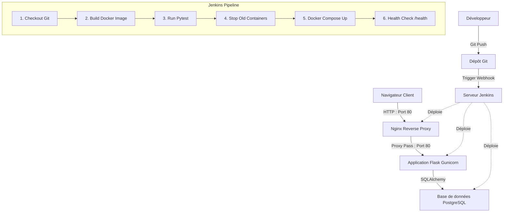

# HelpDesk DevOps - Portail de Gestion de Tickets Informatiques

Ce projet consiste en la mise en place d'une chaîne d'intégration et de déploiement continu (CI/CD) complète pour une application web de gestion de tickets d'assistance (HelpDesk). Il a été conçu comme un travail pratique de démonstration académique pour illustrer le cycle complet du développement logiciel moderne (DevOps).

---

## 🎯 Objectif DevOps

L'objectif principal est d'automatiser entièrement le flux de livraison :
1. Modification du code source de l'application Flask.
2. Push du code sur un dépôt **Git**.
3. Déclenchement automatique d'un pipeline **Jenkins**.
4. Construction de l'image de conteneur **Docker**.
5. Exécution de tests de non-régression automatisés avec **Pytest**.
6. Déploiement automatisé multi-services via **Docker Compose**.
7. Exposition sécurisée au public via le reverse proxy **Nginx** sur le port HTTP standard.

---

## 🛠️ Technologies Utilisées

- **Backend** : Python 3.11, Flask 3.0, Flask-SQLAlchemy, Flask-Login.
- **Base de données** : PostgreSQL 16 (persistance via volumes Docker).
- **Frontend** : HTML5 sémantique, CSS3 (thème "clair mais classe"), Bootstrap 5.3 via CDN.
- **Tests** : Pytest 8.2 (tests unitaires et d'intégration).
- **Conteneurisation** : Docker, Docker Compose.
- **Serveur & Proxy** : Nginx (Reverse Proxy).
- **Intégration Continue (CI/CD)** : Jenkins (Pipeline Déclaratif via `Jenkinsfile`).

---

## 🏗️ Architecture Technique



---

## 📁 Structure des Fichiers

```text
helpdesk-devops/
├── app/
│   ├── __init__.py           # Factory Flask et initialisation des extensions
│   ├── app.py                # Point d'entrée de l'application
│   ├── config.py             # Gestion des configurations applicatives
│   ├── models.py             # Définition des tables users et tickets
│   ├── routes.py             # Contrôleurs généraux (dashboards, tickets, /health)
│   ├── auth.py               # Contrôleurs d'authentification (login, register)
│   ├── requirements.txt      # Dépendances Python du projet
│   │
│   ├── templates/            # Fichiers HTML (Jinja2)
│   │   ├── base.html         # Squelette parent avec navbar Bootstrap 5
│   │   ├── index.html        # Page d'accueil dynamique (version, message)
│   │   ├── login.html        # Formulaire de connexion
│   │   ├── register.html     # Formulaire d'inscription
│   │   ├── dashboard.html    # Dashboard pour l'utilisateur standard
│   │   ├── admin_dashboard.html # Dashboard complet pour l'administrateur
│   │   ├── tickets.html      # Liste de tickets filtrable
│   │   ├── create_ticket.html# Création d'un ticket avec catégorie/priorité
│   │   └── ticket_detail.html# Vue détaillée, réponse admin et mise à jour
│   │
│   └── static/
│       └── css/
│           └── style.css     # Thème personnalisé "clair mais classe"
│
├── tests/
│   └── test_app.py           # Tests automatisés Pytest (Route d'accueil, /health, Login)
│
├── Dockerfile                # Dockerfile de production multi-stage
├── docker-compose.yml        # Orchestrateur (app, postgres, nginx)
├── Jenkinsfile               # Pipeline déclaratif à 6 étapes
├── nginx.conf                # Configuration du reverse proxy Nginx
├── .env.example              # Modèle de variables d'environnement
├── init_db.py                # Script de création et de peuplement de la BDD
└── README.md                 # Ce fichier de documentation
```

---

## ⚙️ Prérequis

- **Docker** et **Docker Compose** installés sur votre machine.
- **Python 3.8+** (si exécution locale hors Docker).
- **Jenkins** configuré avec l'accès au socket Docker (si exécution du pipeline).

---

## 🚀 Installation et Démarrage

### Option 1 : Lancement avec Docker Compose (Production)

Il s'agit de la méthode recommandée qui configure automatiquement toute la stack technique (Nginx, Flask, Postgres).

1. **Cloner le projet** et se placer à la racine :
   ```bash
   cd final_project
   ```

2. **Démarrer la stack** :
   ```bash
   docker compose up -d --build
   ```

3. **Accéder à l'application** :
   Ouvrez votre navigateur et accédez à `http://localhost`.

---

### Option 2 : Lancement Local (Développement hors Docker)

1. **Créer et activer un environnement virtuel** :
   ```bash
   python3 -m venv venv
   source venv/bin/activate  # Sous Windows: venv\Scripts\activate
   ```

2. **Installer les dépendances** :
   ```bash
   pip install -r app/requirements.txt
   ```

3. **Configurer les variables d'environnement** :
   Copier le fichier `.env.example` en `.env` :
   ```bash
   cp .env.example .env
   ```
   *Par défaut, l'application utilisera une base SQLite locale (`app/instance/helpdesk.db`) si aucune base PostgreSQL n'est en ligne.*

4. **Initialiser la base de données locale** :
   ```bash
   python init_db.py
   ```

5. **Lancer le serveur de développement** :
   ```bash
   python app/app.py
   ```
   Accédez à l'application sur `http://localhost:5000`.

---

## 👥 Comptes de Test (Pré-configurés)

Le script `init_db.py` crée automatiquement deux comptes utilisateurs de rôles différents lors du premier démarrage :

| Rôle | Adresse Email | Mot de passe | Permissions |
| :--- | :--- | :--- | :--- |
| **Administrateur** | `admin@helpdesk.local` | `admin123` | Consulter tous les tickets, changer le statut/priorité, ajouter des réponses. |
| **Utilisateur standard** | `user@helpdesk.local` | `user123` | Créer un ticket, voir uniquement ses propres tickets et le statut. |

---

## 🧪 Tests Automatisés

La suite de tests unitaires et d'intégration valide les éléments requis :
- Réponse 200 sur la page d'accueil.
- Statut correct et données de version sur `/health`.
- Présence fonctionnelle des pages de connexion et d'inscription.

Pour exécuter les tests localement :
```bash
pytest tests/
```

Pour les exécuter via Docker :
```bash
docker run --rm app-devops pytest /app/tests/
```

---

## 🔗 Configuration Nginx

Nginx écoute sur le **port 80** de l'hôte et transmet le trafic au conteneur `app` (Flask/Gunicorn) sur le port 80 à l'intérieur du réseau Docker. 

La configuration de redirection se trouve dans [nginx.conf](file:///home/tinah/HESTL/demo_devops/final_project/nginx.conf) :
```nginx
server {
    listen 80;

    location / {
        proxy_pass http://app:80;
        proxy_set_header Host $host;
        proxy_set_header X-Real-IP $remote_addr;
    }
}
```

---

## 🔄 Explication du Pipeline Jenkins

Le fichier `Jenkinsfile` structure le déploiement en 6 stages :
1. **Checkout** : Récupère le code depuis le dépôt Git.
2. **Build Docker Image** : Construit l'image Docker avec le tag `app-devops`.
3. **Run Tests** : Lance les tests `pytest` dans un conteneur éphémère basé sur l'image construite.
4. **Stop Old Containers** : Arrête les anciens conteneurs en cours d'exécution via `docker compose down`.
5. **Deploy with Docker Compose** : Lance la stack multi-services de production en tâche de fond (`docker compose up -d --build`).
6. **Health Check** : Attend 10 secondes puis interroge la route de santé `/health` via `curl`. Si la route ne renvoie pas un statut HTTP correct, le build est marqué en échec.

---

## 🎬 Scénario de Démonstration Vidéo

Pour filmer une vidéo de démonstration complète de 2-3 minutes pour la soutenance du TP :

1. **Introduction de l'interface** :
   - Montrez la page d'accueil sur `http://localhost`.
   - Mettez en avant le message dynamique : *"Application HelpDesk déployée automatiquement avec Jenkins"* et la version *"v1.0.0"*.
   - Expliquez le thème visuel "clair mais classe" (Bootstrap 5, ombres douces, boutons bleus).

2. **Démonstration Client** :
   - Connectez-vous avec `user@helpdesk.local` / `user123`.
   - Montrez le dashboard client (compteurs à 0).
   - Cliquez sur **Nouveau Ticket** et créez un ticket :
     - *Titre* : "Imprimante du 2ème étage indisponible"
     - *Catégorie* : "Matériel"
     - *Priorité* : "Haute"
     - *Description* : "Impossible d'imprimer les rapports de fin de mois. Le voyant rouge clignote."
   - Soumettez le ticket. Vous êtes redirigé sur le dashboard qui affiche désormais 1 ticket créé et ouvert.
   - Déconnectez-vous.

3. **Démonstration Administrateur** :
   - Connectez-vous avec `admin@helpdesk.local` / `admin123`.
   - Vous êtes redirigé vers le **Dashboard Administrateur**.
   - Montrez les statistiques globales (1 total, 1 ouvert, 1 urgent/haut).
   - Cliquez sur le ticket créé par l'utilisateur.
   - Changez le statut de "Ouvert" à **"En cours"**.
   - Saisissez la réponse admin : *"Bonjour, un technicien a été dépêché sur place pour remplacer le toner et nettoyer le tambour de l'imprimante."*
   - Enregistrez les modifications.
   - Déconnectez-vous.

4. **Vérification client final** :
   - Reconnectez-vous avec `user@helpdesk.local`.
   - Cliquez sur le ticket dans le tableau des tickets récents.
   - Montrez la réponse de l'administrateur affichée en bleu et le changement de statut à "En cours".

5. **Démonstration de la Route de Santé** :
   - Accédez à `http://localhost/health` dans le navigateur pour montrer la réponse JSON : `{"status": "ok", "version": "1.0.0"}`.
   - Expliquez que cette route est cruciale pour le stage final du pipeline Jenkins.

---

## ⌨️ Commandes Utiles

### Commandes Git
- Initialiser le dépôt local : `git init`
- Ajouter les fichiers : `git add .`
- Enregistrer les modifications : `git commit -m "feat: initialisation helpdesk devops"`

### Commandes Docker
- Construire l'image Flask manuellement : `docker build -t app-devops .`
- Lancer le conteneur Flask seul : `docker run -d -p 8080:80 --name app-helpdesk app-devops`
- Démarrer tous les services avec Docker Compose : `docker compose up -d`
- Consulter les logs des conteneurs : `docker compose logs -f`
- Arrêter et nettoyer les conteneurs : `docker compose down -v`
